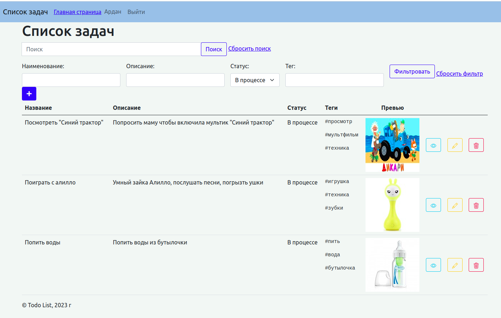

 <h1 align="center">To-Do List</h1>
  <p> Этот проект реализован с помощью PHP 8.1 , фреймворка Laravel и JS / jQuery на фронте, для элементов интерфейса - Bootstrap, а так же - PostgreSql и Nginx.

 <h2>Описание:</h2>
  <p> Это сервис который реализует функционал задачника.
Данные списков хранятся в БД. 
Сохранение задач производится без перезагрузки страницы (ajax).
Для пользователей - регистрация/авторизация, создание, просомтр, редактирование, удаление личных задач.
Произвести поиск по элементам или селать фильтрацию.</p>

<h2>Функционал сервиса:</h2>
<ul>

- Регистрация пользователя
- Аутентификация пользователя
- Просмотр всех задач:
  - В виде списка с пагинацией по 5 записей на страницу
  - Отображаются поля: Название, Описание, Статус, Теги, Превью изображения и иконки для просмотра, редактироавния и удаления задачи
  - При нажатие на превью - в новой вкладке открывается исходное изображение
- Добавление задачи, ввод данных: 
  - Название 
  - Описание 
  - Теги через пробел 
  - Выбрать статус(В процессе/Выполнена)
  - Загрузить изображение
- Просмотр задачи 
  - Название 
  - Описание 
  - Дата создания 
  - Дата обновления 
  - Теги 
  - Превью 
  - Изображение
- Редактирование задачи:
  - Редактирование названия задачи
  - Редактирование описания задачи
  - Смена статуса задачи
  - Редактирование тегов
  - Изменить фотографию
  - Удалить фотографию
- Поиск по элементам, так же можно сбросить поиск
- Фильтрация по элементам, так же можно сбросить фильтр
</ul>

<h2>API:</h2>
<ul>

- GET / - Главная страница
- GET /sign-in - Страница аутентификации пользователя
- POST /sign-in - Отправка данных пользователя для аутентификации
- GET /sign-up - Страница регистрации пользователя
- POST /sign-up - Отправка данных пользователя для регистрации
- GET /sign-out - Выход пользователя из личного кабинета
---
- GET /my-tasks - Просмотр всех задач пользователя
- POST /create-task - Создание задачи
- GET /tasks/{task}/edit - Открытие формы редактирования задачи
- GET /tasks/{task} - Редактирование задачи
- DELETE /tasks/{task} - Удаление задачи
- GET /tasks - Фильтрация задач по элементам

</ul>

<h2>Чтобы запустить проект, выполните:</h2>

Поднять проект:

```make dev-up```


